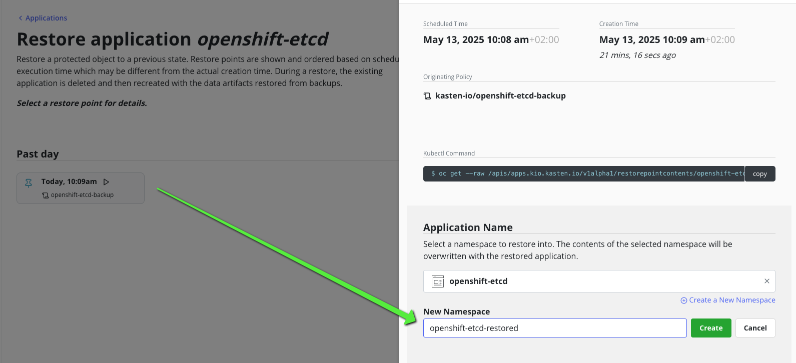
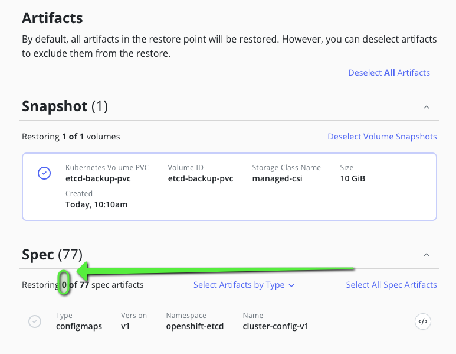

# Goal 

Leverage the [etcd backup operator](https://docs.redhat.com/en/documentation/openshift_container_platform/4.18/html/backup_and_restore/control-plane-backup-and-restore#creating-automated-etcd-backups_backup-etcd) provided by openshift. 

# CAUTION, PLEASE READ THIS CAREFULLY !!!! 

The blueprint is based on a feature that [is still in tech preview](https://docs.redhat.com/en/documentation/openshift_container_platform/4.18/html/backup_and_restore/control-plane-backup-and-restore#creating-automated-etcd-backups_backup-etcd) (even for ocp 4.18). If you decide to follow it you won't be able to upgrade your openshift cluster.

Don't do this on production, wait for this feature become available and fully supported.

# Backup workflow 

In the Before hook policy 
- we create the etcd backup PVC
- we create the etcd backup custom resource, which will store the etcd backup on the pvc

During policy
- we snapshot the pvc and retain the snapshot depending of your local policy rentention
- we export the pvc and retain the portable snapshot depending of your local retention

In the After hook policy 
- we delete the etcd backup custom resource
- we delete the etcd backup pvc


# Restoring 

Pickup a restore point and restore the etcd backup PVC. Attach a busybox pod to the PVC. Then 
- use `oc cp ...` to copy the etcd backup to your local machine 
- use `scp` to copy the etcd backup to control plane node

Then, you need to follow the official procedure provided by Redhat : [Restoring to a previous cluster state](https://docs.redhat.com/en/documentation/openshift_container_platform/4.18/html/backup_and_restore/control-plane-backup-and-restore#dr-scenario-2-restoring-cluster-state_dr-restoring-cluster-state)

We cannot automate this process because it requires too many privileged access (especially to the controle plane machine outside of a regular kubernetes workflow).

# Install the etcd backup operator 

Follow the [procedure](https://docs.redhat.com/en/documentation/openshift_container_platform/4.18/html/backup_and_restore/control-plane-backup-and-restore#creating-automated-etcd-backups_backup-etcd) given by RedHat. 

# deploy the blueprint 

Edit the blueprint line 25 and  and adapt the size of the etcd-backup-pvc to your etcd database.


Install the blueprint 
```
oc create -f etcd-backup-bp.yaml
```

Create a policy that backup openshift-etcd namespace with a before hook and an after hook that invoke the blueprint action beforeBackup and afterBackup.


# Copy the backup on a local machine

Let's say you want to copy the etcd backup on a local machine for doing further operations like [Restoring to a previous cluster state](https://docs.redhat.com/en/documentation/openshift_container_platform/4.18/html/backup_and_restore/control-plane-backup-and-restore#dr-scenario-2-restoring-cluster-state_dr-restoring-cluster-state)

1. Restore the pvc in another namespace for instance openshift-etcd-restored by selecting only pvc 


2. Make sure you only restore the pvc 


3. Once the restore action completed attach a pod to the restored pvc 

```
oc apply -f - <<EOF
apiVersion: v1
kind: Pod
metadata:
  name: etcd-backup-pvc
  namespace: openshift-etcd-restored
spec:
  containers:
  - name: busybox
    image: busybox    
    command:
      - sleep
      - "3600"
    securityContext:
      capabilities:
        drop:
          - ALL
      seccompProfile:
        type: RuntimeDefault
    volumeMounts:
    - name: data
      mountPath: /data
  volumes:
  - name: data
    persistentVolumeClaim:
      claimName: etcd-backup-pvc
EOF
```

4. List the backup in the pvc 

```
oc exec -n openshift-etcd-restored etcd-backup-pvc -- ls /data
```

You should have an output like this one 
```
backup-etcd-single-backup-2025-05-13_080903
lost+found
```

5. Copy the directory in your local machine 

```
oc cp openshift-etcd-restored/etcd-backup-pvc:/data/backup-etcd-single-backup-2025-05-13_080903 backup-etcd-single-backup-2025-05-13_080903
```

You should be able to list the content 
```
ls backup-etcd-single-backup-2025-05-13_080903 
```

The output should be something like 
```
snapshot_2025-05-13_080917__POSSIBLY_DIRTY__.db                 static_kuberesources_2025-05-13_080917__POSSIBLY_DIRTY__.tar.gz
```

