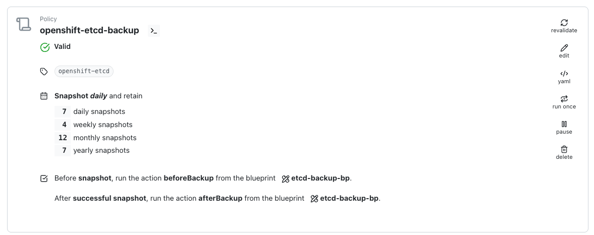

# Goal 

Leverage the [etcd backup operator](https://docs.redhat.com/en/documentation/openshift_container_platform/4.18/html/backup_and_restore/control-plane-backup-and-restore#creating-automated-etcd-backups_backup-etcd) provided by openshift. 

# CAUTION / DISCLAIMER PLEASE READ THIS CAREFULLY !!!! 

The blueprint is based of a feature that [is still in take preview](https://docs.redhat.com/en/documentation/openshift_container_platform/4.18/html/backup_and_restore/control-plane-backup-and-restore#creating-automated-etcd-backups_backup-etcd) (even for ocp 4.18). If you decide to follow it you won't be able to upgrade you openshift cluster.

Don't do this on production, wait for this feature become available and fully supported.

# Backup workflow 

In the Before hook policy 
- we delete the etcd backup pvc if it exist the we recreate it
- we create the etcd backup custom resource, which will store the etcd backup on the pvc

During policy
- we snapshot the pvc and retain the snapshot depending of your local policy rentention
- we export the pvc and retain the portable snapshot depending of your local retention


# Restoring 

You need to follow the official procedure provided by Redhat : [Restoring to a previous cluster state](https://docs.redhat.com/en/documentation/openshift_container_platform/4.18/html/backup_and_restore/control-plane-backup-and-restore#dr-scenario-2-restoring-cluster-state_dr-restoring-cluster-state)

We cannot automate this process because it require too many privileged access (especially to the controle plane machine outside of a regular kubernetes workflow), 
but the procedure expect that you copy the etcd-backup on the controle plane node. 

A simple way to do it is to restore the pvc from the backup using kasten then attach a single busybox pod to this pvc and copy the etcd backup 
on your local machine (using `oc cp ...`) then to the controle plane (using `scp` for instance)

# Install the etcd backup operator 

Follow the [procedure](https://docs.redhat.com/en/documentation/openshift_container_platform/4.18/html/backup_and_restore/control-plane-backup-and-restore#creating-automated-etcd-backups_backup-etcd) given by RedHat. 

# deploy the blueprint 

Edit the blueprint line 25 and  and adapt the size of the etcd-backup-pvc to your etcd database.


Install the blueprint 
```
oc create -f etcd-backup-bp.yaml
```

Create a policy that backup openshift-etcd namespace with a before hook and an after hook that invoke the blueprint action beforeBackup and afterBackup.



# How it works 

- the before hook will create the PVC, the EtcdBackup resource and wait for the EtcdBackup to complete. The etcd backup has been created on the PVC.
- Kasten will protect the namespace with the PVC so now you have a restorepoint that contains the PVC that contains the etcd backup.
- the after hook will clean up the EtcdBackuo resource and the PVC so that the next policy run can recreate them.

Depending of your retention you'll be able to restore the PVC in the restore point of your choice and follow the [restore procedure](https://docs.redhat.com/en/documentation/openshift_container_platform/4.18/html/backup_and_restore/control-plane-backup-and-restore#creating-automated-etcd-backups_backup-etcd) given by RedHat. 


